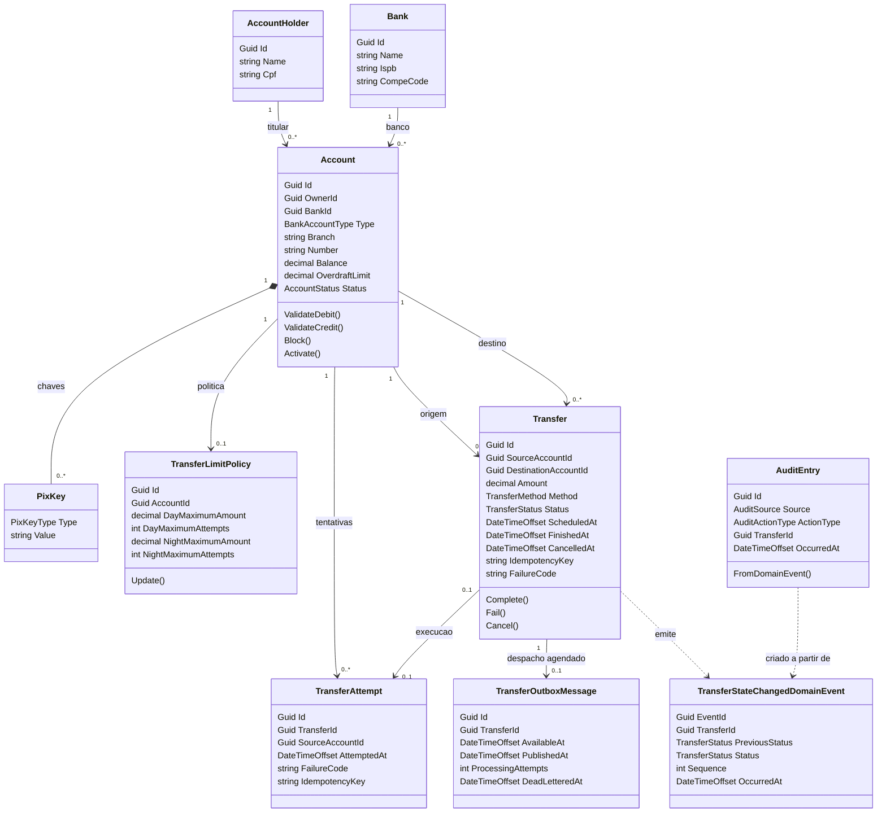

# teste-tecnico-btsa

Aplicação de transferências bancárias via Pix ou agência/conta, com execução imediata, agendamento, cancelamento e consulta de detalhes. Inclui um painel React para testar saldo, cheque especial, limites e situação das contas.

## Executar a aplicação completa

Pré-requisitos: Docker Desktop com containers Linux (ou Docker Engine com Compose), acesso à internet no primeiro build e as portas abaixo disponíveis. Não é necessário instalar .NET ou Node na máquina para esta modalidade.

Depois de clonar o repositório, execute na raiz:

```powershell
docker compose --env-file .env.dev up -d --build
```

Aguarde a inicialização do banco, do RabbitMQ e da API. As migrations e o seed são executados automaticamente. Os arquivos `.env.dev` da raiz e do frontend estão versionados com configurações de demonstração; não é necessário criá-los manualmente.

| Serviço | Endereço | Credenciais locais |
| --- | --- | --- |
| Frontend | http://localhost:3001 | Sem autenticação |
| Swagger | http://localhost:5154/swagger | Sem autenticação |
| Hangfire | http://localhost:5154/hangfire | Ambiente Development |
| RabbitMQ Management | http://localhost:15673 | `btsa` / `btsa-local` |
| Grafana | http://localhost:3300 | `admin` / `btsa-local` |
| Prometheus | http://localhost:19090 | Sem autenticação |
| PostgreSQL | `localhost:5434`, banco `postgres` | `btsa` / `btsa-local` |

A API é compilada em **Release**, mas o Compose usa **Development** como ambiente de execução para habilitar o seed e as configurações administrativas usadas na avaliação. Trata-se do ambiente de demonstração do teste.

Para verificar a inicialização e parar os serviços preservando os dados:

```powershell
docker compose --env-file .env.dev ps
docker compose --env-file .env.dev logs --tail 100 api
docker compose --env-file .env.dev down
```

## Executar em desenvolvimento

Além do Docker, instale .NET SDK 10 e Node.js 24 com npm. Na raiz, suba somente as dependências:

```powershell
docker compose --env-file .env.dev up -d postgres rabbitmq
dotnet run --project TesteTecnico.Api --launch-profile http
```

Em outro terminal, inicie o frontend:

```powershell
cd tt-btsa-webapp
npm ci
npm run dev
```

Abra http://localhost:3001. A API local usa `appsettings.Development.json` para conectar ao PostgreSQL em `localhost:5434` e ao RabbitMQ em `localhost:5673`. O frontend carrega `tt-btsa-webapp/.env.dev`: `VITE_API_BASE_URL` vazio utiliza `/api`, e `VITE_API_PROXY_TARGET` aponta o proxy do Vite para a API em `http://127.0.0.1:5154`.

Se a aplicação completa já estiver rodando no Compose, execute `docker compose stop api frontend` antes de iniciar esses processos localmente, liberando as portas. Alterações nas variáveis do frontend exigem reiniciar o Vite.

## Decisões arquiteturais

- **Vertical Slice Architecture e DDD:** `Features` organiza endpoints, contratos e handlers por caso de uso; `Domain` concentra entidades e regras; `Infrastructure` reúne persistência, mensageria e serviços técnicos. Minimal APIs registram as rotas por funcionalidade, com dependências resolvidas por DI. O Result Pattern representa falhas esperadas de negócio, e DTOs separam os contratos HTTP das entidades.
- **Persistência e concorrência:** EF Core e PostgreSQL persistem valores monetários em `numeric(18,2)` e enums nativos. Migrations versionam o schema. Débito, crédito, estado e auditoria de domínio são confirmados na mesma transação; locks de linha nas contas, adquiridos em ordem determinística, evitam que transferências simultâneas gastem o mesmo saldo.
- **Transferência imediata e agendada:** a imediata aguarda o resultado no HTTP. A agendada usa Hangfire para disparar a publicação no RabbitMQ e um consumidor para processar a fila. Ambos reutilizam o mesmo executor financeiro. Hangfire e consumidor rodam dentro da API, simplificando a execução do teste.
- **Entrega e recuperação:** o agendamento e sua outbox são persistidos juntos. Uma rotina recupera publicações pendentes; o consumidor confirma a mensagem após o commit. Idempotência e verificação de estados terminais impedem movimentação duplicada. Rejeições de negócio encerram a transferência como `Failed`; falhas técnicas têm retries limitados e dead-letter queue.
- **Limites por conta:** cheque especial e política de transferência pertencem à conta. Um titular pode ter contas em bancos diferentes, com limites independentes. Esta é uma adaptação deliberada do escopo discutida para o projeto. Limites e status são reavaliados ao executar um agendamento.
- **Eventos e auditoria:** `TransferStateChangedDomainEvent` representa fatos ocorridos no domínio. Esses eventos originam registros em `audit_log` dentro da transação financeira; auditoria HTTP registra a ação e seu resultado. Isso não constitui event sourcing: o estado atual continua persistido nas entidades.
- **Observabilidade:** Serilog produz logs estruturados com contexto do componente; Loki armazena os logs, Prometheus coleta métricas e Grafana permite consultá-los. Health checks distinguem processo ativo de dependências disponíveis.
- **Frontend:** React e TypeScript separam `pages`, `components`, `hooks`, `services` e `types`. Axios centraliza o acesso HTTP. Vite em desenvolvimento e Nginx no Compose encaminham as chamadas para a API pelo mesmo caminho `/api`.

## Diagrama de classes

Visão resumida das classes existentes, com seus principais atributos e relacionamentos. As associações por identificador não implicam propriedades de navegação C#. `TransferOutboxMessage` pertence à infraestrutura; as setas tracejadas representam produção ou conversão de eventos, não chaves estrangeiras.



Datas de agendamento, término, cancelamento e publicação são opcionais conforme o estado. Uma tentativa rejeitada antes de criar a transferência pode não ter `TransferId`; registros de auditoria HTTP também podem não estar associados a uma transferência. CPF do titular, ISPB do banco, chave Pix e a combinação banco/agência/número da conta possuem unicidade no banco.

## API

A API local usa PostgreSQL e RabbitMQ do Compose em `localhost:5434` e `localhost:5673`. Para subir o ambiente completo em containers, incluindo a API publicada em Release, frontend, Grafana, Loki e Prometheus, basta executar na raiz:

```powershell
docker compose --env-file .env.dev up -d --build
```

O Compose carrega as configurações internas do arquivo `.env.dev`. O seed de demonstração é aplicado pela API quando ela inicia. Para usar os containers de infraestrutura e executar a API/frontend pelo Visual Studio e Vite, use `docker compose up -d postgres rabbitmq` e siga as instruções de execução local abaixo.

As migrations são aplicadas automaticamente na inicialização da API. Hangfire roda dentro do processo da API e usa o PostgreSQL; a API também abre a conexão com RabbitMQ no startup. A aplicação para se não conseguir conectar ao banco, atualizar o schema ou abrir o broker. A imagem da API publica o projeto em `Release`; o container usa o ambiente `Development` para habilitar o dashboard Hangfire, endpoints locais de configuração e dados de demonstração. Os endpoints obrigatórios, Swagger e OpenAPI ficam disponíveis em qualquer ambiente.

Em Development, depois das migrations, um seed idempotente garante três bancos fictícios, dez titulares com CPFs sintéticos e treze contas com saldos, chaves Pix e políticas de demonstração. O primeiro titular possui contas em bancos diferentes; há contas bloqueada e inativa para testar envio e recebimento. O seed não substitui configurações já alteradas; assim, mudanças feitas durante os testes permanecem após reiniciar a API.

Os CPFs de demonstração são sintéticos; a migration preenche os titulares antigos com esses identificadores porque o cadastro anterior não guardava CPF. As respostas da API mostram o CPF mascarado.

Em Development, use `GET /api/accounts` e `GET /api/accounts/{accountId}` para consultar IDs, titular/CPF mascarado, banco, saldo, status, cheque especial e chaves Pix. As contas para teste vêm do seed; não há fluxo de cadastro de conta porque esse caso de uso não faz parte do foco do teste.

`PUT /api/accounts/{accountId}/status` recebe `{"status":"Blocked"}`, `{"status":"Inactive"}` ou `{"status":"Active"}` para bloquear, inativar ou reativar a conta. A mudança usa lock de linha e é serializada com a transferência em execução. Contas bloqueadas ou inativas falham como origem e como destino, e transferências agendadas reavaliam o status na hora do processamento. Os endpoints de cheque especial são `GET` e `PUT /api/accounts/{accountId}/overdraft-limit`; `DELETE` define o limite como zero e falha se a conta já estiver usando o cheque especial. Essas rotas administrativas e as de política de limites são expostas somente em `Development`.

As políticas de limite pertencem à conta, assim como o cheque especial. Cada conta pode ter uma política de transferência; titular/CPF e banco são contexto cadastral, não definem o escopo do limite. Em Development, o CRUD está disponível em `GET/POST /api/transfer-limit-policies`, `GET/PUT/DELETE /api/transfer-limit-policies/{policyId}`. A criação recebe `accountId`; a política configura valores máximos e quantidade de tentativas de dia e de noite, persistidos para edição nos testes.

O fluxo de transferências usa `POST /api/transfers` para transferências imediatas síncronas, `POST /api/transfers/scheduled` para agendamentos, `GET /api/transfers/{id}` para acompanhar o estado e `POST /api/transfers/{id}/cancel` para cancelar somente enquanto o estado for `Scheduled`. A transferência imediata aguarda o mesmo executor financeiro usado pelo consumidor RabbitMQ e retorna `200` com o resultado final (`Completed` ou `Failed`). O agendamento retorna `202` e é processado por Hangfire e RabbitMQ na data informada. Os dois POST aceitam o header opcional `Idempotency-Key`. Repetir a chave com os mesmos dados retorna a transferência existente; reutilizá-la com conteúdo diferente gera conflito. A modalidade é `Pix`, com `pixKey`, ou `BankAccount`, com `bankIspb`, `branch`, `accountNumber` e `checkDigit` opcional. Por exemplo:

```json
{
  "sourceAccountId": "019942d0-0010-7000-8000-000000000010",
  "method": "Pix",
  "amount": 100.00,
  "pixKey": "conta10000002@example.com"
}
```

O endpoint agendado recebe os mesmos dados e um `scheduledAt` futuro em ISO 8601 com offset. Ele retorna `202 Accepted`; consulte o recurso para acompanhar `Scheduled`, `Processing`, `Completed`, `Failed` ou `Cancelled`. A transferência imediata retorna o estado final na própria resposta; uma falha de regra de negócio inclui `failureCode`, sem débito ou crédito parcial.

Transferências imediatas obtêm locks das contas em ordem determinística antes de inserir a transferência e executam dentro da mesma transação PostgreSQL. Assim, a inserção com FKs não promove locks de conta enquanto outra execução tenta bloqueá-las. Agendamentos persistem com uma mensagem de outbox na mesma transação; Hangfire publica no horário escolhido. O consumidor RabbitMQ roda dentro do mesmo processo da API e usa o mesmo executor financeiro da chamada síncrona. A fila durável é `transfers.processing`; o consumidor usa ack manual e só confirma após o commit do débito, crédito, tentativa e estado. A rotina de recuperação republica itens vencidos da outbox se o processo cair antes do despacho Hangfire ou entre o commit da publicação e sua marcação local. Mensagens repetidas são seguras: estados terminais não movimentam saldo novamente. Mensagens inválidas ou com falhas técnicas após cinco retries vão para `transfers.processing.dead-letter`; o GET da transferência expõe `processingError` e `isInDeadLetter` quando a execução precisa de intervenção.

Na execução, a API bloqueia origem e destino em ordem determinística e bloqueia a política da conta de origem. Ela verifica situação ativa de ambas as contas, saldo com cheque especial, limite monetário e tentativas numa janela móvel de 60 minutos. Tentativas rejeitadas depois de identificar uma origem também são persistidas; replay com a mesma chave idempotente não consome outra tentativa. Agendar e cancelar não consomem cota. Rejeições financeiras ficam como `Failed`, sem movimentação parcial. Agendamentos reavaliam todas as condições no momento da execução. Dia é de 06:00 a 22:00 e noite de 22:00 a 06:00 no fuso `America/Sao_Paulo`, conforme a configuração `TransferRules`.

Se uma mensagem for para a dead-letter queue, abra RabbitMQ Management (`http://localhost:15673`), inspecione `transfers.processing.dead-letter`, corrija a causa técnica e publique novamente no destino `transfers.processing` uma mensagem persistente com o corpo `{"TransferId":"<id-da-transferencia>"}`. A execução consulta o estado financeiro persistido, então reencaminhar uma mensagem já concluída/cancelada não repete o débito. O diagnóstico técnico detalhado fica nos logs correlacionados pelo `TransferId`; a API não expõe a mensagem interna da exceção.

As rotas anotadas persistem a ação HTTP, o modelo da rota, o resultado e identificadores de rota sem registrar corpos de requisição. As mudanças do domínio de transferência também emitem eventos que entram em `audit_log` junto com as alterações financeiras na mesma transação. `GET /api/transfers/{id}` devolve esse histórico; a interface o mostra nos detalhes da transferência. Registros de API e de domínio são distinguidos por `source`.

Os testes de integração do processamento usam PostgreSQL real e cobrem criação síncrona concorrente, replay de rejeição, somatório e expiração da janela, fronteiras dia/noite, cheque especial, status, agendamento e cancelamento. Configure `BTSA_TEST_CONNECTION` para um banco descartável cujo nome termine em `_test` antes de executar `dotnet test TesteTecnico.Api.Tests/TesteTecnico.Api.Tests.csproj`; a suíte limpa as tabelas de negócio e auditoria entre os casos. Sem essa variável, a suíte marca os testes PostgreSQL como ignorados. Não aponte essa variável para o banco local de desenvolvimento.

Para criar uma migration, na pasta `TesteTecnico.Api`:

```powershell
dotnet tool restore
dotnet ef migrations add <NomeDaMigration> --context AppDbContext --output-dir Infrastructure/Migrations
```

Para subir apenas PostgreSQL e RabbitMQ durante o desenvolvimento local, na raiz do repositório:

```powershell
docker compose --file docker-compose.yaml --env-file .env.dev up --detach postgres rabbitmq
```

Depois inicie a API localmente, na pasta `TesteTecnico.Api`. O perfil de inicialização abre automaticamente a interface Swagger:

```powershell
dotnet run --launch-profile http
```

Endereços locais: frontend `http://localhost:3001`, API `http://localhost:5154`, liveness `http://localhost:5154/health/live`, readiness `http://localhost:5154/health/ready`, Swagger `http://localhost:5154/swagger`, documento OpenAPI `http://localhost:5154/openapi/v1.json`, Hangfire `http://localhost:5154/hangfire`, RabbitMQ Management `http://localhost:15673`, Grafana `http://localhost:3300` e Prometheus `http://localhost:19090`. O usuário/senha local do Grafana são `admin` / `btsa-local`.

As credenciais de demonstração ficam em `.env.dev`; o Compose as injeta nos serviços. A configuração `appsettings.Development.json` mantém os endereços `localhost` para executar a API localmente. A instância Postgres do Compose publica a porta `5434`, deixando as portas `5432` e `5433` livres para instâncias Postgres já instaladas na máquina. Essas credenciais são apenas para execução local, não para produção.

## Testes de integração completos

Com Docker Desktop, .NET SDK 10 e Python 3 instalados, execute na raiz:

```powershell
./scripts/test-integration.ps1
```

O script usa o projeto Compose `btsa-integration`, portas próprias e bancos descartáveis `btsa_integration_test` (handlers) e `btsa_e2e_test` (API real). Não usa os volumes de desenvolvimento. Ele testa concorrência, idempotência, agendamento, cancelamento, outbox, DLQ, indisponibilidade do broker, rollback no commit, métricas/logs e rotas em Production. As falhas são injetadas exclusivamente nesse banco de teste. Os serviços e volumes de teste são removidos ao terminar, inclusive em caso de erro; `-KeepRunning` permite inspecioná-los.

Portas de teste: frontend 23001, API 25154, PostgreSQL 25432, RabbitMQ 35672/35673, Grafana 23300 e Prometheus 29090. A instância temporária Production usa 25155. A execução precisa dessas portas disponíveis. Nunca execute simultaneamente duas instâncias dessa suíte, pois elas compartilham o projeto descartável.

Para executar somente as chamadas HTTP após subir o Compose de integração, use `python -X utf8 scripts/integration_test.py`. A suíte limpa dados desse ambiente. Testes monetários do frontend: `cd tt-btsa-webapp; npm test`.

## Frontend

O painel React/TypeScript em `tt-btsa-webapp` consulta contas e políticas, permite ver detalhes das contas, bloquear/inativar/reativar contas, configurar limites de transferência e editar o cheque especial. Na tela de transferências, contas não ativas continuam selecionáveis para reproduzir a rejeição e exibir o motivo. Na execução local, com a API rodando, inicie-o em outra janela:

```powershell
cd tt-btsa-webapp
npm ci
npm run dev
```

Abra `http://localhost:3001`. O Vite encaminha as chamadas `/api` para `http://localhost:5154`; o Swagger continua em `http://localhost:5154/swagger`. Os contratos e fluxos ficam organizados em `src/components`, `src/pages`, `src/services`, `src/hooks` e `src/types`; as diretivas de frontend estão em `dotnet-btsa-frontend.mdc`. A página de transferência permite abrir os detalhes completos pelo ID, com atualização do status enquanto o agendamento estiver pendente.

## Logging

A API usa Serilog no console; no Compose, envia os eventos também ao Loki pelo sink Serilog. Cada evento inclui timestamp, nível e `SourceContext` para identificar a classe ou componente que o emitiu. Inicialização, migrations, conexões com RabbitMQ e requisições HTTP bem-sucedidas são registrados em `Information`; detalhes de rotina ficam em `Debug` (habilitado em Development). Requisições 4xx são `Warning`, falhas 5xx e exceções são `Error` ou `Fatal`.

O Grafana provisiona automaticamente as fontes Prometheus e Loki e o dashboard `BTSA / BTSA API - Logs`. Ele consulta os logs da API com o rótulo `{app="teste-tecnico-btsa-api"}`; os arquivos ficam persistidos no volume `loki-data` com retenção de sete dias. A API continua escrevendo no console, mesmo quando Loki não está configurado para uma execução local.

Para parar os serviços, rode `docker compose down`. Para apagar também os dados persistidos nos volumes do Compose, use `docker compose down --volumes`.
